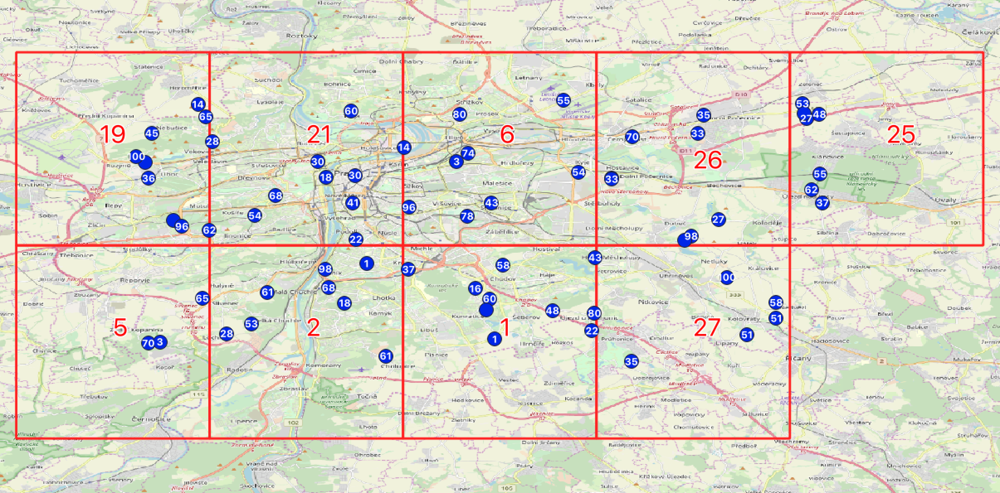
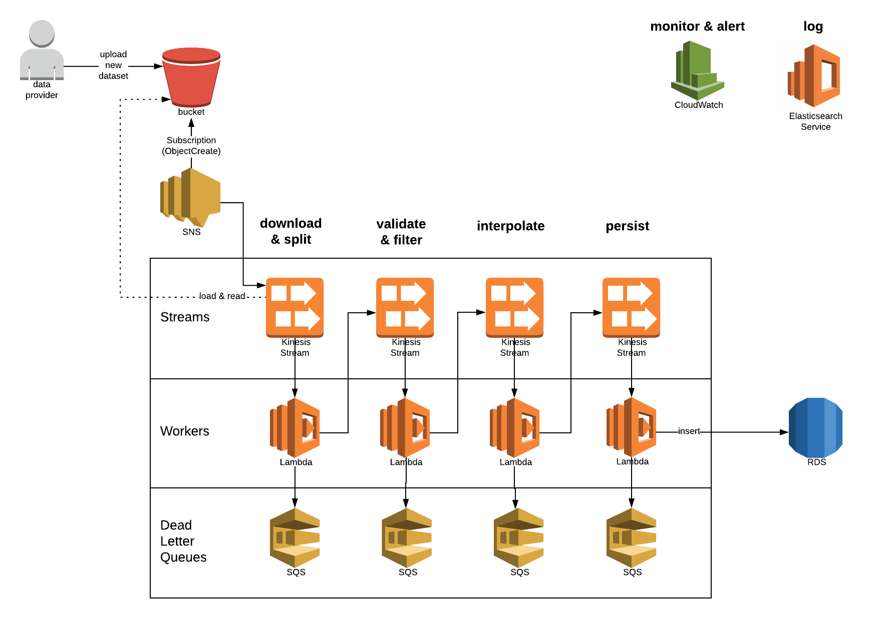

# data-engineer-code-challenge

## Requirements

to build & run locally:

* JDK & JRE >= 1.8
* Postgres 9 + PostGIS service

to build & run containerized environment:

* docker
* docker-compose

for IDE:

* Lombok plugin

## test, build, start

test: `./gradlew clean test`

integration test: `./gradlew clean integrationTest` :warning: depends on a running Postgres instance, see `applications.yml`

build: `./gradlew clean build`

start: `./gradlew clean bootRun` :warning: depends on a running Postgres instance, see `applications.yml`

## start containerized environment

`docker-compose up` :warning: depends on build (see above), no Postgres required.

## accessing

http://localhost:8080

## about my solution

### general approach

* :yellow_heart: automated process 
  * data can get pushed to the service
* :green_heart: grouping trips by origin, destination and hour of the day 
  * during ingestion the origin, destination is linked to a 0.1°x0.1° grid cell.
  * e.g. `SELECT id, origin_cell_fk, destination_cell_fk, hour_of_day FROM trips`
  * ERD and map from QGIS is listed below
* :green_heart: calculate statistics based on region and bbox
  * /stats?region=prague&minLat=53&minLon=10&maxLat=54&maxLon=11 responds with a list of daily stats (number of trips per weekday)
* :heart: status of data ingestion
  * not finished. I wanted to visualize the ingestion state on a dashboard (Grafana, Graphite, Statsd), but didn't finished yet
* :heart: solution should be scalable
  * failed by design (ingestion via post), an event based solution would make much more sense so solve this
* :green_heart: programming language and database
  * I used Java and Postgres/PostGIS. 
  * I thought about using Kotlin (less typing) and SQLite (in memory for testing)
* :green_heart: containerize
  * Service itself is dockerized
  * it also comes together with a Postgres/PostGIS in a docker-compose
  * proposal for an AWS environment is listed below
   
#### ERD

(created with _DbVisualizer_)

#### debug / preview with QGIS

(created with _QGIS_)

#### AWS environment proposal

(created with _lucidchart_)

#### what I've learned

* The fact that the actual use-case is not very clear leads to much freedom and -for sure- misunderstandings. 
  * "trips for an area" for instance: orig && dest within area? orig || dest within area? linestring(orig, dest) intersects area?
  * "status of ingestion" as well
* I lost a lot of time trying to implement the database transactions in RxJava JDBC.
